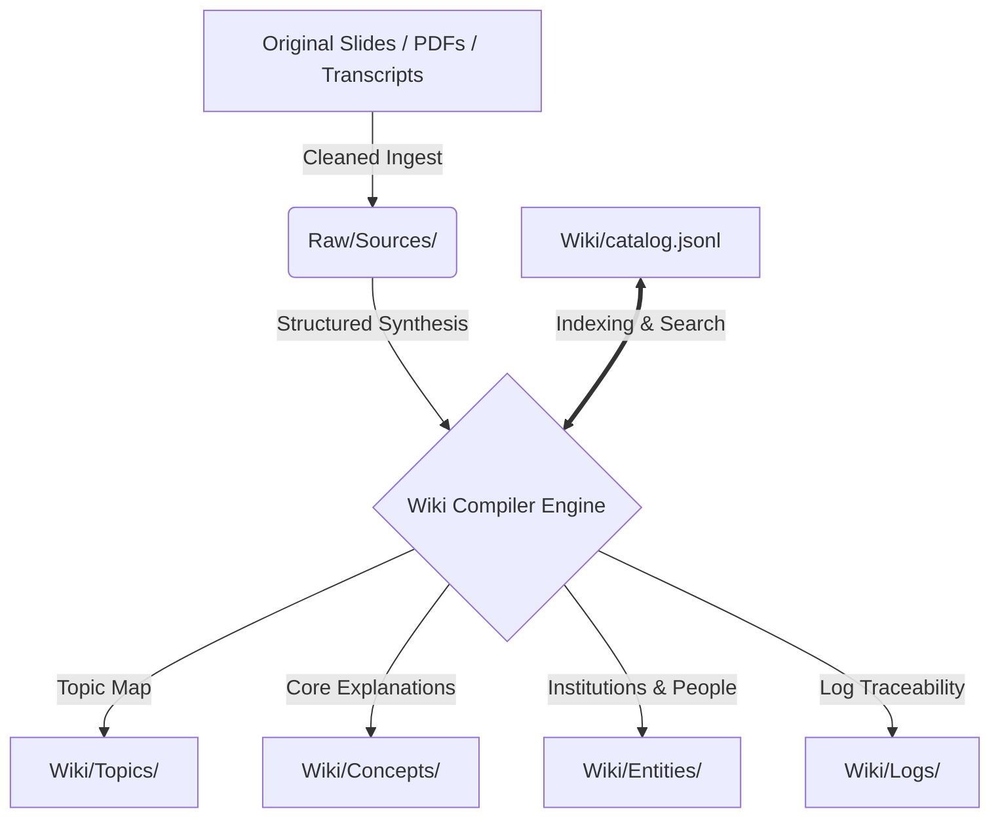

# 🎓 Bocconi Academic LLM Wiki

[](LICENSE)
[](https://obsidian.md/)
[](https://www.python.org/)
[](scripts/wiki_tool.py)

Welcome to the **Bocconi Academic LLM Wiki** — a premium, high-fidelity, two-layer Obsidian-based knowledge system designed for AI-assisted academic learning, research, and retrieval. This system compiles and structures rigorous academic materials from multiple Università Bocconi courses into a clean, semantically linked database.

---

## 🏛️ Course Vault Coverage

This repository currently hosts comprehensive, structured lecture notes, definitions, formulas, and concepts across the following Bocconi academic curricula:

*   **30001** 📊 Statistics (Modules 1 & 2)
*   **30006** 🏦 Financial Markets and Institutions
*   **30017** 📈 Corporate Finance (Modules 1 & 2)
*   **30018** 💼 Management
*   **30065** 🍎 Microeconomics
*   **30066** 📉 Macroeconomics
*   **30120** 🌍 Economic History
*   **30264** 🏛️ Public Finance
*   **30693** 📝 Financial Accounting (Modules 1 & 2)

---

## ⚙️ Vault Architecture: Two-Layer Design

This system leverages a highly reliable **Two-Layer separation design** to prevent OCR noise, duplicate content, and model hallucinations from corrupting the core academic knowledge.



### 1. The Raw Layer (`Raw/`)
*   **`Raw/Sources/`**: Holds markdown-formatted original lecture transcripts, slides, and class notes. Never modified after ingest.
*   **`Raw/Files/`**: Binary files (PDFs, high-resolution diagrams, images) which are ignored in Git to maintain lightweight repositories.

### 2. The Wiki Layer (`Wiki/`)
Compiled, peer-reviewed, and high-fidelity notes. Every claim in the Wiki must trace back directly to its original slide/lecture source.
*   **`Wiki/Topics/`**: Overviews outlining course sections, syllabi, and overarching modules.
*   **`Wiki/Concepts/`**: Focused pages dedicated to proving formulas, definitions, and academic concepts.
*   **`Wiki/Entities/`**: Profiles on economists, institutions, and major tools/frameworks.
*   **`Wiki/Logs/`**: History logs tracking system ingests, AI agent sessions, and vault-wide milestones.

---

## 🔍 Getting Started

### For Students (Obsidian Users)
1. **Clone the repository** into your local directory.
2. **Open with Obsidian:** Choose "Open folder as vault" and select this repository's root.
3. **Start from the Core:** Open [[Wiki/index.md]] (the centralized hub) to navigate course overviews and structural indices.
4. **Interactive Search:** Leverage Obsidian's global graph view to see the beautiful semantic mesh linking cross-course concepts.

### For AI Coding Assistants / Copilots
This vault enforces a strict maintenance protocol for LLMs and AI coding agents. If you are an AI assistant working on this codebase:
*   Read and follow [AGENTS.md](AGENTS.md) before performing any read or write operations.
*   Always perform a catalog search (`Wiki/catalog.jsonl`) before parsing wide context raw files.
*   Maintain strictly validated frontmatter fields.

---

## 🛠️ Tooling & Validation

The vault features built-in deterministic Python scripts to automate cataloging, linting, and verification.

| Command | Action |
|:---|:---|
| `python scripts/wiki_tool.py build` | Recompiles the centralized `catalog.jsonl` index and per-folder Markdown indexes. |
| `python scripts/wiki_tool.py lint` | Validates YAML frontmatter conformity, link syntax, and strict allowed tags. |
| `python scripts/wiki_tool.py source-lint` | Asserts every Compiled Wiki note properly references valid raw files in `sources`. |
| `python scripts/wiki_tool.py doctor` | Audits the internal structure for orphan nodes, broken links, or schema errors. |
| `python scripts/audit_public.py` | Inspects the vault to ensure no local paths or credential leaks exist before commits. |

### The Pre-Commit Gate
To keep the vault healthy, clean, and secure, run this chained verification before committing any changes:
```bash
python scripts/wiki_tool.py doctor
python scripts/wiki_tool.py build
python scripts/wiki_tool.py lint
python scripts/wiki_tool.py source-lint
python scripts/audit_public.py
```

---

## 📜 License
This repository is configured for academic usage and pair-programming study. The codebase and structured templates are licensed under the [MIT License](LICENSE).
